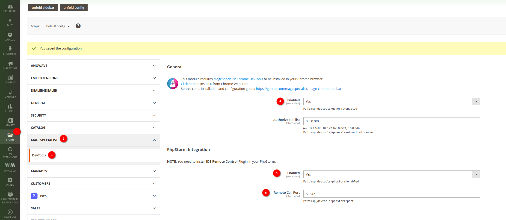
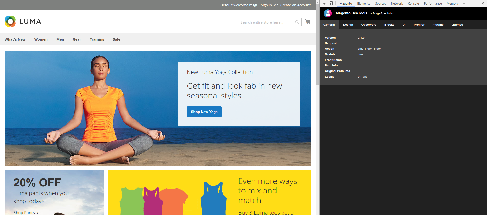
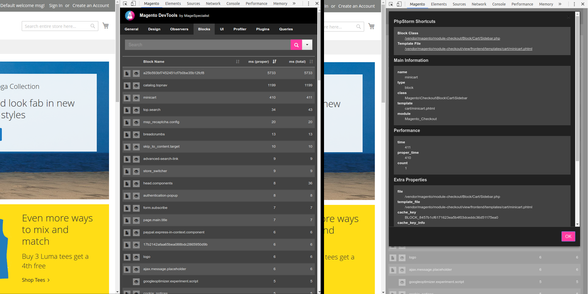
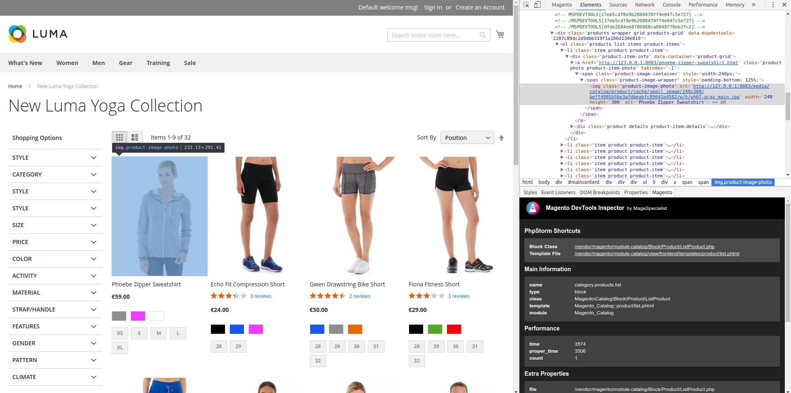
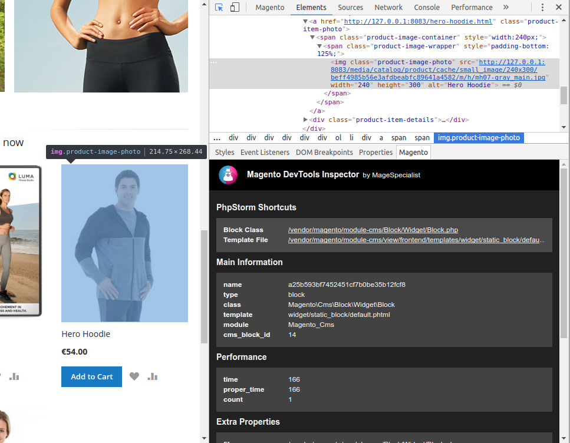

# MageSpecialist DevTools for Magento 2

## Installing and configuring the plugin

1. Install the plugin via composer. Please ensure bigbridge is the repository in your composer.json file:
```json
{
  .......
  "repositories": {
    "packagist.org": false,
    "0-artifacts": {
      "type": "artifact",
      "url": "artifacts"
    },
    "1-bigbridge": {
      "type": "composer",
      "url": "https://repo.bigbridgedev.nl"
    },
    "2-bigbridge-yourshopname": {
      "type": "composer",
      "url": "https://repo.bigbridgedev.nl/yourshopname"
    }
  },
  ......
}
```

```bash
  composer require --dev msp/devtools
  bin/magento setup:upgrade
```

### Configuring the plugin

* Go to store > configuration > magespecialist > devtools

* Set Enabled to Yes(4)
* Set phpstorm integration enabled to Yes(5)
* Set the remote call port to 63342(6)
* Save the congiguration
* Flush the cache
* Disable full page cache
```bash
bin/magento cache:disable full_page 
```

## Installing toolbar companion module

This module is intended to be used with **MageSpecialist Chrome Toolbar**.

Readme and installation guide can be found here: https://bitbucket.org/bigbridge-nl/msp_devtools/src/master/

## Installing on Magento 2:
Please refer to this page: https://github.com/magespecialist/mage-chrome-toolbar#installing-on-magento-2

## Some screenshot

#### Theme, Controller and Global information: 


#### Blocks / Containers information:


#### uiComponents information:


#### Phpstorm shortcuts


#### Profiler information:


#### Inspector integration


# Known Issue

When using [axios](https://github.com/axios/axios]) always set 

`headers: {'X-Requested-With': 'XMLHttpRequest'}` 

in your request config to avoid to avoid to obtain json with appended `<script>` tag as described in [Issue #33](https://github.com/magespecialist/m2-MSP_DevTools/issues/33)